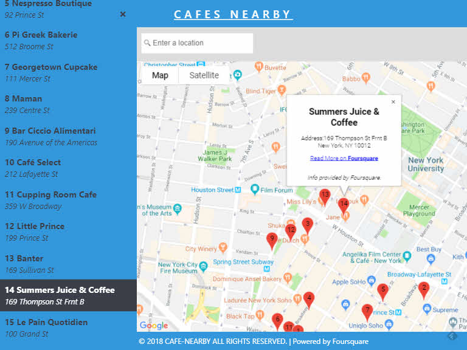

# Cafes Nearby 
The **Cafes Nearby** is a project from Front-End Web Developer Nanodegree Program of Udacity and part of the scholarship Grow With Google. It use [React](https://reactjs.org/) 16.5.2 to make the front-end and [Create React App](https://github.com/facebookincubator/create-react-app) was used to bootstrap the project. It has Accessibility functionality.

# Table of Contents

* [Overview](#overview)
* [How to run the project](#how-to-run-the-project)
* [Dependencies](#dependencies-used)
* [APIs Used](#apis-used)
* [Contributing](#contributing)
* [Credits and Useful Links](#credits-and-useful-links)

## Overview

This is a  map of some cafes in the SOHO area, New York City, as proposed by [Foursquare](https://foursquare.com/). The app allows you to filter the list of venues and their markers in the map as you type. You can click the markers to get more information about the venue.




## How to run the project

To run the project follow the instructions below: 

Download or clone [https://github.com/primer101/Cafes-Nearby.git](https://github.com/primer101/Cafes-Nearby.git)

Change directory to the repository folder, example cd c:/my-app and then in the repository folder:
* install project dependencies with 
```
npm install
```
* start the server : 
```
npm start
```
* open [http://localhost:3000](http://localhost:3000) to view it in the browser.

## Dependencies Used

* The project was generated with [create-react-app](https://github.com/facebook/create-react-app), it includes React and ReactDOM as dependencies and other node.js modules.
* [query-string](https://www.npmjs.com/package/query-string) for stringify URL query strings.
* [react-search-input](https://github.com/enkidevs/react-search-input) for a search input, providing a filter function.
* [react-burger-menu](https://www.npmjs.com/package/react-burger-menu), an off-canvas sidebar React component with a collection of effects .


## APIs used

* [Google Maps API](https://developers.google.com/maps/documentation/) for the map.
* [FourSquare](https://developer.foursquare.com/) for getting the information for the the restaurants

## Contributing

This repository is part of an Udacity course project. Therefore, we most likely will not accept pull requests.

## Credits and Useful Links

"Nanodegree" is a registered trademark of Udacity. © 2011–2018 [Udacity, Inc.](https://www.udacity.com/)

Copyright (c) 2018 [Leonardo Daudinot](https://www.linkedin.com/in/leonardodaudinot/) and [Udacity, Inc](https://www.udacity.com/)

Released under the [MIT License](LICENSE.txt) and the [Terms of Service](https://help.github.com/articles/github-terms-of-service) of GitHub.